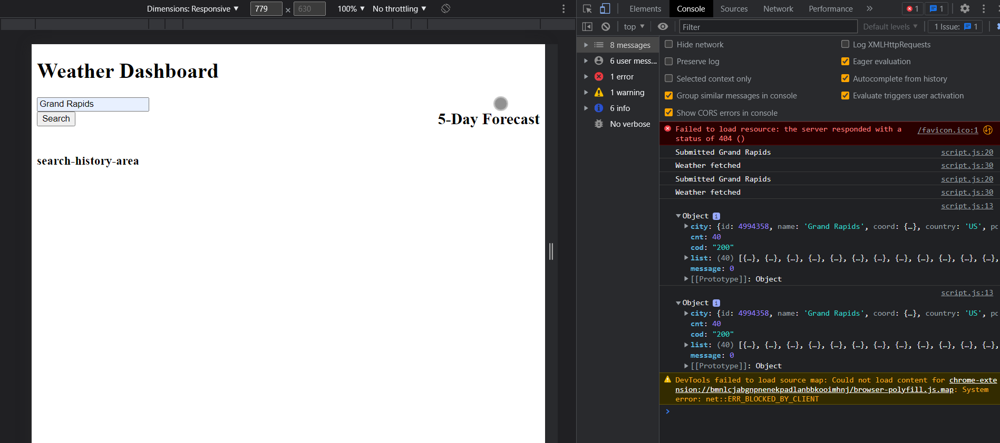

# Weather-Dashboard
Module 6 Server-Side APIs Challenge: Weather Dashboard

## Technology Used 

| Technology Used         | Resource URL           | 
| ------------- |:-------------:| 
| HTML    | [https://developer.mozilla.org/en-US/docs/Web/HTML](https://developer.mozilla.org/en-US/docs/Web/HTML) | 
| CSS     | [https://developer.mozilla.org/en-US/docs/Web/CSS](https://developer.mozilla.org/en-US/docs/Web/CSS)      |   
| Git | [https://git-scm.com/](https://git-scm.com/)     |    
| JavaScript | [https://www.javascript.com/](https://www.javascript.com/)     |   

## Description 

[Visit the Deployed Site](https://makeitouthill.github.io/Weather-Dashboard//)

This webage was designed to fetch and catch data of weather based on users search inputs.

## Usage 

1. Vist site URL
2.In search bar, Input city name
3. Click Search
4. Open up Console
5.In Message wait and see Openweather data arrive
6.Search for another city

## Learning Points 

   Through this project I learn more about API, and Correctly Inputing new values for URLS.
   Learn more about Await/async syntaxs. Aswell as ways to make sure the script loads before the html.

## Credits

### Alex Horning

* [Github](https://github.com/makeitouthill/)

## License
    None

---